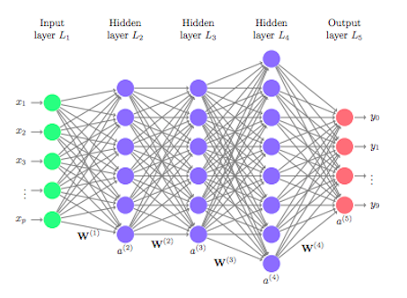
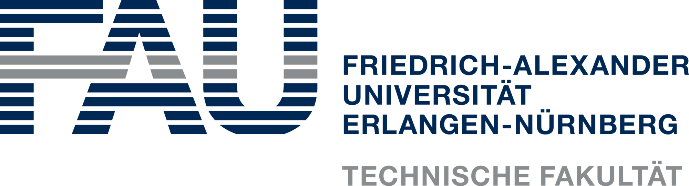

  
  <h1>Deep Learning Exercises</h1>
  
  <h2>Winter Semester 2023</h2>

## Topics
* **Ex 0**: Warmup - Plot Checkerboard, RGB Color Spectrum
* **Ex 1**: Fully Connected Network - ReLU, SoftMax
* **Ex 2**: Convolutional Neural Network - Max-Pooling, Initializer
* **Ex 3**: Recurrent Neural Network - Dropout, LSTM, Batch Normalization
* **Ex 4**: ResNet for Solar Crack Detection using PyTorch

## Dependencies
* [scikit-image](http://scikit-image.org/)
* [numpy](https://www.numpy.org/)
* [OpenCV](https://pypi.org/project/opencv-python/)
* [matplotlib](https://matplotlib.org)

## Reference
* [FAU Deep Learning Lectures](https://www.youtube.com/playlist?list=PLpOGQvPCDQzvgpD3S0vTy7bJe2pf_yJFj)
